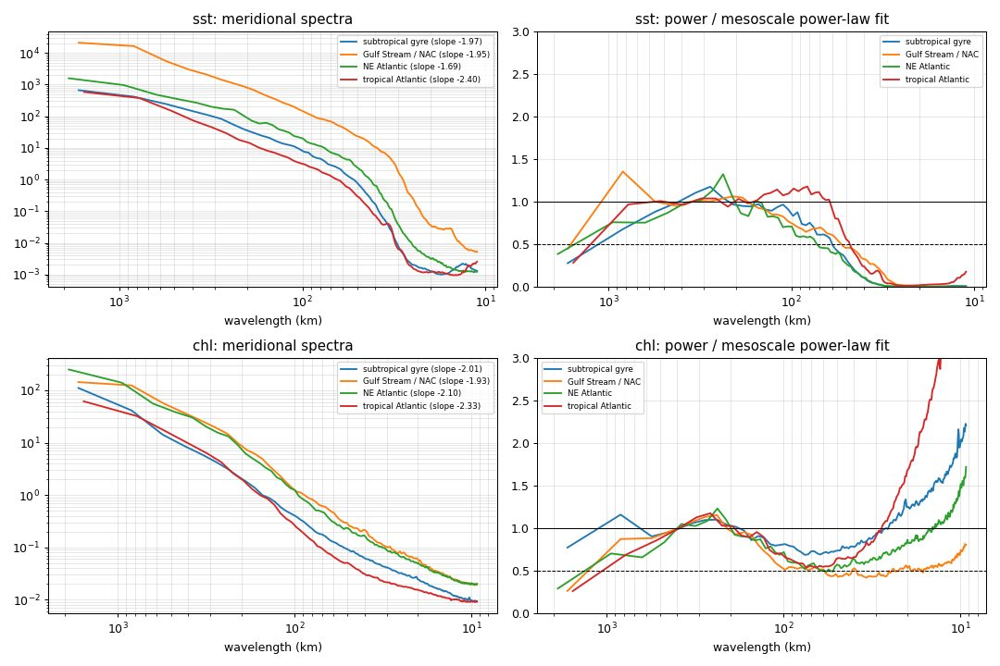
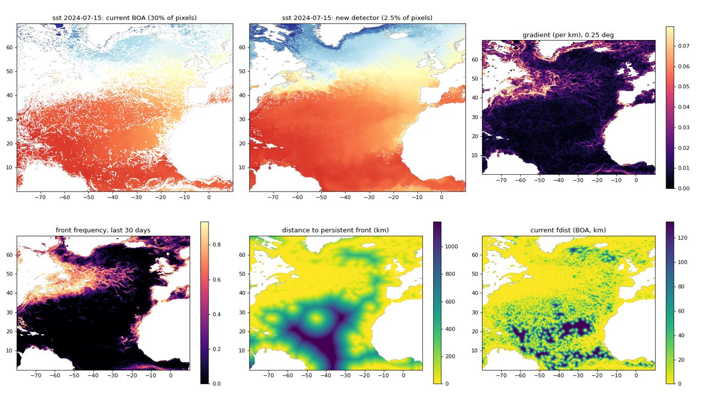
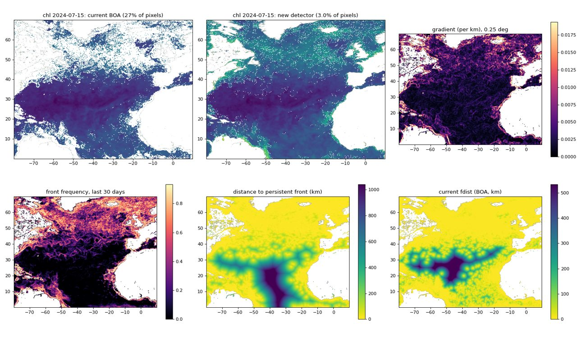

# Front layers for species distribution models

Status: design, nothing implemented. Decisions settled 2026-09-30 (§9).
Written 2026-09-30 against `dev` @ 855a0d0. Every number below comes from the
scripts in [`front-layers/prototype/`](front-layers/prototype/README.md), run
read-only against the deployed sst and chl stores.

## 0. Summary

`sst_fdist` and `chl_fdist` (distance to the nearest Belkin–O'Reilly front, BOA)
are the only front information h2mare publishes, and their only consumers are
species distribution models (SDMs). This plan replaces them with layers built for
that purpose, from a detector suited to the L4 products they come from.

| | Today | Proposed |
|---|---|---|
| Detector | BOA on a 3×3 Sobel, threshold per grid cell | Canny-style: Gaussian smoothing at the product's resolution, per-km gradient, thinning, hysteresis |
| chl | linear concentration | log10 concentration |
| Units | per grid cell, index space | per km, corrected for latitude |
| Confidence | none | sst `analysis_error` mask; masked days count as *unobserved* |
| SDM layers | daily distance to front | **gradient magnitude** + **30-day front frequency**, per variable |
| Where | convert time, native store | convert time, native store (unchanged) |

| Decision | Value | Evidence |
|---|---|---|
| sst smoothing σ | 5 km | §4.1: no noise floor; ±50% leaves the published layers at ρ ≥ 0.98 |
| chl smoothing σ | **7 km** | §4.1: removes the noise floor below 30 km; ±50% moves the layers (ρ 0.91–0.93) |
| Thresholds | low = p75, high = **p90** of the smoothed gradient, as fixed physical values | §4.2: stable within ±3% over 2004–2024; p95 moves the layers (ρ 0.88–0.91) |
| sst | low 0.0155, high 0.0299 °C/km | 3-year mean percentiles |
| log10 chl | low 0.0035, high 0.0070 per km | 3-year mean percentiles |
| Low/high ratio | 2:1 | §4.2: 3:1 leaves the published layers at ρ ≥ 0.97 |
| sst confidence cut | `analysis_error` > 0.84 K, fixed | §4.3: p90–p99 all give frequency ρ = 1.00 |
| Frequency window | 30 days | §4.4 |

The two sensitive parameters (high threshold, chl σ) were adopted at their
recommended defaults without an SDM test; §9 records the decision and how to
revisit it.

## 1. Background

### 1.1 What exists

`boa_fronts` in `config.yaml` declares a front-distance layer per var_key
(`sst_fdist` from sst at threshold 0.4, `chl_fdist` from chl at 0.06).
`processing/core/fronts.py` detects fronts day by day at convert time and writes
the distance (km) from every sea cell to the nearest front pixel into the native
store; compile regrids it into h2ds like any other column, and it reaches Parquet
from there. The layers feed SDMs only.

### 1.2 Defects already fixed (#239, merged 2026-09-29)

- BOA filled missing cells with 0, so every coastline was a front: 99% of
  coast-adjacent sst cells, against 77% one cell further in.
- A day with no fronts wrote 20,015 km everywhere (11 all-null chl days,
  1998–2002, on disk).
- Distances were computed where the source field itself had no value.

The stores still hold the pre-#239 values until the front layers are recomputed.

### 1.3 Defects this plan addresses

**The threshold saturates.** BOA's threshold applies to a Sobel magnitude on the
raw grid. A linear ramp gives 8× the per-cell difference, so sst's 0.4 means
0.05 °C per 0.05° cell, about **0.009 °C/km**. That is roughly the *median*
gradient (p50 = 0.0084 °C/km, `02_gradient_distribution.py`). Coverage and
distance against threshold (`01_boa_threshold_sweep.py`, 4 days of 2024, **run
before #239**, so the coastline artefact is included):

| sst threshold | °C/km | front % | median distance | chl threshold | per km | front % | median distance |
|---|---|---|---|---|---|---|---|
| 0.2 | 0.0045 | 71.7 | 0 km | 0.015 | 0.0004 | 66.0 | 0 km |
| **0.4 (current)** | **0.0090** | **42.3** | **5.9 km** | 0.03 | 0.0008 | 44.9 | 3.2 km |
| 0.8 | 0.0180 | 18.6 | 33.8 km | **0.06 (current)** | **0.0016** | **28.9** | **14.7 km** |
| 1.2 | 0.0270 | 10.5 | 79.6 km | 0.12 | 0.0032 | 19.0 | 51.5 km |
| 1.6 | 0.0360 | 6.7 | 136.6 km | 0.24 | 0.0065 | 12.2 | 119.8 km |
| 2.4 | 0.0540 | 3.4 | 281.0 km | 0.5 | 0.0135 | 7.4 | 208.7 km |

With 42% of the ocean a "front" and a median distance of 6 km, which is under one
0.25° h2ds cell, the covariate is near zero almost everywhere after compile.

**The threshold is in grid-cell units.** It would change meaning if the product
changed resolution.

**Detection depends on latitude and orientation.** The Sobel runs in index space.
A longitude cell is cos(lat) as wide in km as a latitude cell, so the same
east–west gradient gives a smaller per-cell difference: under-detected by about
29% at 45°N and 50% at 60°N.

**chl is on a linear scale.** Chl is roughly lognormal, so linear gradients scale
with concentration: p99/p50 of the gradient is 176 on the linear scale and 12 on
log10. Linear fronts pile up in productive coastal water, and oligotrophic fronts
disappear. Current chl front coverage swings 20–38% over the year.

**Pixel-scale gradients measure noise or smoothing, not the ocean** (§2).

## 2. What the data resolve

An L4 product is an interpolated analysis: observations from several sensors and
days blended onto a gap-free grid, with smoothing built in. Its grid spacing is
not its resolution. How far down the fields hold real structure decides the
smallest scale any front layer can honestly claim.

### 2.1 Method

Wavenumber spectra (`03_effective_resolution.py`, `04_…_years.py`):

- **Boxes:** four open-ocean boxes chosen to avoid land (subtropical gyre 20–35°N
  60–35°W; Gulf Stream/NAC 35–50°N 55–30°W; NE Atlantic 38–55°N 30–15°W;
  tropical Atlantic 4–18°N 45–25°W).
- **Days:** the 15th of each month; sst in °C, chl on log10.
- **Spectra:** mainly along meridians, where the spacing is exact (5.56 km sst,
  4.64 km chl). Lines are detrended and Hann-windowed, and only complete lines
  (no gaps) are used. Zonal spectra, whose spacing varies with latitude, serve
  as a cross-check.
- **Criterion:** fit a power law over 150–600 km, where mesoscale variability is
  well resolved (fitted slopes −1.7 to −2.4, typical of mesoscale SST). The
  **effective resolution λ½** is the largest wavelength below 150 km at which the
  measured power falls to half the extrapolated fit. The local slope over 12–40 km,
  and the ratio of power to fit over 12–25 km, tell smoothing (steepening, ratio
  → 0) from a noise floor (flattening, ratio > 1).

### 2.2 Results



2024, λ½ meridional / zonal:

| Box | sst λ½ | sst slope 150–600 / 12–40 km | chl λ½ | chl slope 150–600 / 12–40 km |
|---|---|---|---|---|
| Subtropical gyre | 60 / 48 km | −1.97 / −2.62 | never falls | −2.01 / −1.40 |
| Gulf Stream / NAC | 52 / 66 km | −1.95 / −6.37 | 58 / 79 km | −1.93 / −1.70 |
| NE Atlantic | 70 / 104 km | −1.69 / −4.65 | 57 / 82 km | −2.10 / −1.54 |
| Tropical Atlantic | 47 / 49 km | −2.40 / −2.76 | never falls | −2.33 / −0.92 |

Across years (λ½ meridional; in brackets, power ÷ fit at 12–25 km):

| | Gyre | Gulf Stream / NAC | NE Atlantic | Tropical |
|---|---|---|---|---|
| sst 2004 | 62 km (0.00) | 73 km (0.00) | 73 km (0.00) | 58 km (0.01) |
| sst 2014 | 60 km (0.00) | 83 km (0.00) | 82 km (0.00) | 56 km (0.01) |
| sst 2024 | 60 km (0.00) | 52 km (0.00) | 70 km (0.00) | 47 km (0.03) |
| chl 2004 | — (1.82) | 70 km (0.54) | 65 km (0.37) | 111 km (2.06) |
| chl 2014 | — (1.27) | 62 km (0.63) | 79 km (0.44) | 92 km (3.65) |
| chl 2024 | — (1.34) | 58 km (0.53) | 57 km (0.91) | — (2.18) |

### 2.3 Interpretation

- **sst resolves 50–80 km.** Below ~30 km the spectrum collapses two to three
  orders of magnitude (local slope down to −6), which is the analysis's
  smoothing. There is **no noise floor**. It varies by region, coarser in the
  cloudier north, and little over 20 years.
- **log10 chl resolves 60–110 km in productive water.** In the oligotrophic gyre
  and the tropics, the small scales are **retrieval noise**, 1.3–3.6× above the
  power law in every year: log10 amplifies noise at low concentration.
- **Consequences:**
  - pixel-scale chl gradients in oligotrophic water are mostly noise, which
    explains part of chl's front coverage swings;
  - the smallest honest scale for any gradient layer is **~50 km**;
  - front *positions* are good to tens of km, so daily distances of a few km
    claim precision the data do not have;
  - the 0.25° h2ds grid (~28 km) is finer than the information it holds. That is
    fine as a grid, but detection must stay on the native grid: a 0.25° grid
    only resolves wavelengths down to ~56 km, right at the products' limit.
- **Caveats:** four Atlantic boxes and 12 days per year, and half-power is a
  convention. Treat the values as ranges.

### 2.4 A test set aside

We also measured how much gradient variance survives Gaussian smoothing at
σ = 1–8 cells (sst loses 16% at σ = 1 cell). That turned out not to measure
resolution: gradient variance is weighted toward the smallest scales, so even
light smoothing attenuates the resolved 50–100 km band. It is not used.

## 3. Detector

### 3.1 Choice of method

| Option | Verdict for 0.05°/1/24° L4 fields |
|---|---|
| BOA (Belkin & O'Reilly 2009), as today | Its contextual median suppresses speckle and cloud edges in L2/L3 imagery, which L4 does not have. Its single per-pixel threshold marks every pixel above it, giving bands several cells wide and scattered speckle, which pull distances down |
| Canny (1986) | Thinning (non-maximum suppression) puts a front on its centre line; hysteresis keeps weak pixels only when connected to strong ones, removing speckle. Used for SST fronts in oceanography (as we recall, Castelao et al. 2006). Its Gaussian smoothing must be set at the product's scale, not the pixel's |
| Cayula–Cornillon (SIED) | Histogram bimodality in windows, designed for cloudy L2 scenes. Much heavier, and no advantage on gap-free fields |
| Gradient magnitude alone | Threshold-free and continuous. Kept as a layer (§5), but it does not locate fronts, which frequency and persistence need |

Adopted: **Canny's thinning and hysteresis, on a gradient computed in physical
units at the product's resolution.** BOA's median filter is dropped; it solves a
problem these products do not have.

### 3.2 Steps (per day, per variable)

1. **Transform:** chl → log10; sst as is.
2. **Gap fill:** fill every missing cell from its nearest valid cell (from #239),
   so land and ice edges carry the field flat across and are not read as fronts.
3. **Smooth:** a Gaussian of width σ **in km on both axes**. Separable: the
   north–south width is σ / Δy, and the east–west width is set per row as
   σ / Δx(lat), because a longitude cell narrows with latitude.
4. **Metric gradient:** centred differences divided by the true cell size,
   Δy = Δlat · 111.2 km and Δx = Δlon · 111.2 km · cos(lat). The magnitude is in
   °C/km (sst) or log10(mg m⁻³)/km (chl), and its meaning does not change with
   latitude, orientation or grid resolution.
5. **Thinning:** keep a pixel only if its magnitude is at least that of both
   neighbours along the gradient direction (four direction bins, in index space).
6. **Hysteresis:** candidates are thinned pixels ≥ low. Keep each
   8-connected group of candidates that contains at least one pixel ≥ high
   (`scipy.ndimage.label`).
7. **Confidence mask (sst):** pixels with `analysis_error` above the cut can be
   neither candidates nor seeds, and are recorded as **not assessed** (§4.3).
   Missing cells are also not assessed.
8. **Outputs:** the daily front mask (front / no front / not assessed) and the
   gradient magnitude from step 4.

No new dependency: `scipy.ndimage` and about 30 lines of numpy for the thinning.
Cost in the prototype: about 3.5 s/day for sst and 2.8 s/day for chl, per worker.

## 4. Parameters and how each was chosen

### 4.1 Smoothing width σ

A Gaussian of width σ keeps exp(−(2πσ/λ)²) of the power at wavelength λ:

| λ | sst σ = 5 km | chl σ = 7 km |
|---|---|---|
| 20 km | 29% | 1% |
| 30 km | 58% | 12% |
| 50 km | 67% | 46% |
| 60 km | 76% | 58% |
| 100 km | 91% | 82% |

- **sst, 5 km (about one grid cell).** sst has no noise floor (§2.3), so nothing
  needs removing. The smoothing only stabilises the gradient *direction* that
  thinning uses. "About one cell" is the smallest value that does that; it was
  not optimised. §4.5 shows it does not need to be: ±50% leaves the published
  layers (gradient, frequency) at ρ ≥ 0.98; only the daily front fraction moves
  (ρ 0.90–0.92).
- **chl, 7 km (1.5 cells), adopted (§9).** Chosen to remove the noise floor below ~30 km
  (88–99% of that power) while keeping at least half the power at 60 km. It is a
  trade-off, and §4.5 shows it matters: σ × 0.5 lets noise back in (front pixels
  nearly double; frequency ρ 0.91), and σ × 1.5 removes structure (frequency
  ρ 0.93). The spectrum supports 6–9 km. Testing 5 / 7 / 10 km in the SDMs was
  proposed and skipped (§9); 7 km is the spectral choice.
- **Correction during the work:** prototype v1 converted σ to cells using the
  latitude spacing on both axes, which made it narrower than intended east–west
  at high latitude. v2 (above) is what the implementation uses.

### 4.2 Hysteresis thresholds

**Definition.** Percentiles of the smoothed metric gradient over all valid sea
pixels in the domain, on 24 days per year (the 1st and 15th of each month):

- **high = p90:** a gradient in the domain's strongest 10% can *start* a front;
- **low = p75:** a front is *extended* along its ridge while the gradient stays in
  the strongest 25%.

In plain terms: **a front is where gradients are among the strongest 10% in this
domain**, traced along its ridge to where they fall out of the top 25%. After
thinning only ridge lines remain, so about 2.5% of pixels are fronts, not 10%.

**Calibration (v2, σ in km; `08_calibrate_multi_year.py`, `calibration_multi.json`):**

| | p75 2004 / 2014 / 2024 | p85 2004 / 2014 / 2024 | p90 2004 / 2014 / 2024 | p95 2004 / 2014 / 2024 |
|---|---|---|---|---|
| sst σ 5 km, °C/km | 0.0155 / 0.0154 / 0.0155 | 0.0230 / 0.0220 / 0.0230 | 0.0306 / 0.0287 / 0.0305 | 0.0477 / 0.0433 / 0.0470 |
| log10 chl σ 7 km, per km | 0.00345 / 0.00346 / 0.00358 | 0.00519 / 0.00520 / 0.00538 | 0.00685 / 0.00686 / 0.00715 | 0.0102 / 0.0103 / 0.0108 |

The spread across 20 years is ±3% for sst and ±2.5% for chl.

**Decisions, and why:**

1. **Store fixed physical values, not percentiles.** Recomputing percentiles each
   year would move the standard with the ocean, so layers would not compare
   across years. The values above are stable enough to fix. **Adopted:** the
   three-year means, **sst 0.0155 / 0.0299 °C/km** and **chl 0.0035 / 0.0070 per km**.
2. **Percentile-based, not literature-based.** Published front thresholds were
   set on L2/L3 imagery and on other regions. On a smoothed L4 analysis, the same
   physical front shows a weaker gradient (the Gulf Stream north wall is far
   sharper in reality than in OSTIA), so borrowed values would not transfer. A
   percentile says what fraction of this data's gradients count, which is
   interpretable here. For scale, 0.030 °C/km is 3 °C per 100 km: a clear
   mesoscale front in this product.
3. **Consequence: the values are specific to this bbox.** Widening the domain
   shifts the percentiles, but the fixed values stay put. A different bbox, or
   another product, needs recalibration with `08_calibrate_multi_year.py`.
4. **Ratio 2:1** (p75/p90 ≈ 0.52 for sst, 0.50 for chl), the low end of the
   2:1–3:1 range usually recommended for Canny. §4.5 shows 3:1 leaves the
   published layers at ρ ≥ 0.97, so the choice barely matters; 2:1 keeps fronts a little more connected.
5. **The high threshold is the sensitive one.** It decides *which* fronts count:
   many moderate fronts (p85) or only the major ones (p95). That is an
   ecological question the data cannot answer; p90 was adopted as the default
   without an SDM test (§9).

**Prototype v1** used 2024 alone, with the v1 σ: sst 0.0157 / 0.0312 °C/km, chl
0.0037 / 0.0076 per km. It produced the full-year results in §5.

### 4.3 Confidence mask (sst `analysis_error`)

OSTIA publishes a per-pixel analysis error. Where observations are sparse, the
analysis relaxes toward its background, and gradients there are weakened or
invented. The chl product has no uncertainty field, so chl has no mask.

| `analysis_error` | p90 | p95 | p99 |
|---|---|---|---|
| 2004 | 0.73 K | 1.02 K | 1.86 K |
| 2014 | 0.64 K | 0.87 K | 1.69 K |
| 2024 | 0.63 K | 0.84 K | 1.52 K |

**Decisions:**

1. **Cut at 0.84 K** (2024 p95): the worst-supported ~5% of pixels, mostly cloudy
   high latitudes and ice margins. The daily median masked share in 2024 is 4.8%.
   §4.5: p90 or p99 leave the frequency unchanged (ρ = 1.00) and the other
   layers at ρ ≥ 0.98. The value is not critical.
2. **Fixed, not per-year.** Error is higher in early years (fewer
   observations), so a fixed cut masks roughly twice as much of 2004 as of 2024.
   That is the honest outcome: those pixels are less supported. A per-year
   percentile would keep coverage constant by lowering the standard as the
   analysis gets worse.
3. **Masked means unobserved, not "no front".** Prototype v1 first counted
   masked days as "no front", which punched square holes into the 30-day
   frequency (the error field is coarse and blocky). The rule is therefore:
   frequency = fronts ÷ **days assessed**, and a cell assessed on fewer than half
   the window's days is NaN. The same applies to every mask, including missing
   data.

### 4.4 Frequency window and persistence

- **30 days**, a conventional monthly window. The 7-day frequency correlates
  0.82–0.83 with it, so offering both adds little. The config takes a list in
  case an SDM wants another scale.
- **Persistent front** (only needed for the alternative layer, distance to
  persistent fronts): a pixel with a front within ±1 pixel on at least 30% of
  the days it was assessed in the last 30. The ±1 pixel tolerance absorbs
  day-to-day shifts. §4.5: 0.2 vs 0.5 keeps the ranking (ρ 0.91–0.97), but the
  median distance changes several-fold (sst 44 km vs 114 km). So the *value* of
  "km from a persistent front" depends on it, and it would need justifying if
  that layer is chosen.

### 4.5 Sensitivity analysis

**Method** (`09_sensitivity.py`, v2):
- one parameter varied at a time around the baseline (§0), on four 30-day
  windows of 2024 ending 31 Jan, 30 Apr, 31 Jul and 31 Oct;
- each variant detected on all 120 days;
- its layers on the four end dates compared with the baseline's by Spearman ρ
  over sea cells, pooled;
- σ variants use thresholds recalibrated at that σ, so only the smoothing
  changes, not the share of gradients counted.

**sst** (ρ vs baseline; front % = mean share of pixels flagged):

| Variant | front % | median persistent distance | gradient | front fraction (daily) | frequency | persistent distance | daily distance |
|---|---|---|---|---|---|---|---|
| baseline | 2.39 | 65 km | — | — | — | — | — |
| σ × 0.5 | 2.70 | 60 km | 0.997 | 0.915 | 0.982 | 0.988 | 0.983 |
| σ × 1.5 | 2.05 | 73 km | 0.996 | 0.898 | 0.978 | 0.987 | 0.977 |
| high = p85 | 3.04 | 39 km | 1.000 | 0.863 | 0.953 | 0.952 | 0.914 |
| high = p95 | 1.45 | 171 km | 1.000 | 0.752 | **0.884** | **0.902** | 0.875 |
| ratio 3:1 | 2.67 | 57 km | 1.000 | 0.948 | 0.973 | 0.990 | 0.988 |
| error cut p90 | 2.01 | 71 km | 1.000 | 0.907 | 0.999 | 0.976 | 0.975 |
| error cut p99 | 2.68 | 62 km | 1.000 | 0.934 | 1.000 | 0.986 | 0.983 |
| persistence 0.2 | — | 44 km | — | — | — | 0.972 | — |
| persistence 0.5 | — | 114 km | — | — | — | 0.951 | — |

**log10 chl:**

| Variant | front % | median persistent distance | gradient | front fraction (daily) | frequency | persistent distance | daily distance |
|---|---|---|---|---|---|---|---|
| baseline | 2.01 | 84 km | — | — | — | — | — |
| σ × 0.5 | 3.75 | 39 km | 0.966 | 0.742 | **0.914** | 0.926 | **0.847** |
| σ × 1.5 | 1.42 | 118 km | 0.981 | 0.781 | **0.929** | 0.959 | 0.920 |
| high = p85 | 2.56 | 48 km | 1.000 | 0.863 | 0.944 | 0.941 | 0.883 |
| high = p95 | 1.30 | 177 km | 1.000 | 0.781 | **0.898** | **0.909** | 0.858 |
| ratio 3:1 | 2.15 | 77 km | 1.000 | 0.969 | 0.981 | 0.993 | 0.993 |
| persistence 0.2 | — | 47 km | — | — | — | 0.950 | — |
| persistence 0.5 | — | 185 km | — | — | — | 0.906 | — |

**Conclusions:**

- **The gradient layer is insensitive to every parameter** (ρ ≥ 0.97). It depends
  only on σ, and barely on that.
- **Settled** (ρ ≥ 0.95 on the published layers): sst σ, the low/high ratio, the
  sst error cut.
- **Open:** the high threshold (p95 moves frequency and persistent distance to
  ρ 0.88–0.91), and chl σ (frequency ρ 0.91–0.93, daily distance 0.85).
- **The daily layers** (front fraction, daily distance) are the most sensitive to
  everything. The 30-day frequency is much more robust, one more reason to
  publish it rather than daily distances.
- **Limits:** one year, four windows, rank correlation only. Flexible SDMs
  (boosted trees, GAMs) are largely insensitive to monotonic rescaling, so a high
  ρ means "will not change the model much", not "same values". Absolute values
  do shift: the median persistent distance ranges 39–177 km across threshold
  variants.

## 5. Layers for SDMs

### 5.1 Candidates

Built on the 0.25° h2ds grid, where the SDMs see them. Native pixels are
aggregated by block (5×5 for sst, 6×6 for chl; both grids align exactly with
h2ds); distances are measured from 0.25° cell centres to native front pixels.

| Layer | Definition |
|---|---|
| `grad` | Mean per-km gradient magnitude in the cell |
| `grad_nbhd{50,100,200}` | `grad` averaged over a Gaussian neighbourhood of 50 / 100 / 200 km (NaN-aware) |
| `front_frac` | Share of the cell's native pixels that are fronts today |
| `freq7`, `freq30` | Share of the last 7 / 30 assessed days with a front in the cell |
| `fdist` | Distance to today's nearest front |
| `fdist_persist` | Distance to the nearest persistent front (§4.4) |
| `fdist_boa` | Today's `fdist` (current BOA), as the baseline |

The 100 km neighbourhood came from an early suggestion without an ecological
basis, and was kept only as one of three scales to measure.

### 5.2 Full-year results (prototype v1, 2024)




The top row of each map shows native fronts over the field (BOA, then the new
detector). The bottom row shows the gradient, 30-day frequency, distance to
persistent fronts and the current BOA `fdist`.

Daily medians, `06_run_year.py`:

| | sst new | sst BOA | chl new | chl BOA |
|---|---|---|---|---|
| Front pixels per day | 61,537 (2.4%) | 756,723 (30%) | 82,323 | 717,439 |
| Connected pieces | 2,620 | 3,360 | 4,860 | 8,955 |
| Median piece, pixels | 14 | 11 | 10 | **2** |
| Share of pixels in pieces < 5 px | 2.2% | 0.3% | 3.8% | 1.7% |
| Next day's front within 2 px | 69% | 93% | 68% | 93% |

- **BOA's chl "fronts"** have a median piece of 2 pixels: speckle.
- **The new detector** traces the Gulf Stream/NAC, shelf breaks, the NW African
  and Iberian upwelling, and the subpolar bloom edges as continuous lines.
- **BOA's higher next-day stability is an artefact of coverage:** with 30% of
  pixels flagged, almost anything has a front within 2 pixels the next day. A
  fair stability comparison needs matched coverage. For thin lines on a product
  resolving ~50 km, 69% within 11 km is reasonable.
- **chl front activity varies 3× over the year:** median front pixels are 41k in
  January against 125k in May. That is the spring bloom, plus fewer valid
  high-latitude pixels in winter.

Distance percentiles (km), p10 / p25 / p50 / p75 / p90:

| | `fdist` new | `fdist_persist` | `fdist_boa` |
|---|---|---|---|
| sst | 6.7 / 21 / 80 / 276 / 645 | 0 / 11 / 69 / 279 / 689 | 0 / 0 / 5.6 / 21 / 50 |
| chl | 5.9 / 17 / 72 / 229 / 450 | 2.8 / 8.3 / 78 / 311 / 629 | 2.7 / 3.0 / 14 / 55 / 145 |

### 5.3 Redundancy (`07_analyze.py`, 60,000 sampled sea cell-days, Spearman)

- **The neighbourhood gradients are near duplicates.**
  - sst: 50–100 km ρ = 0.97, 100–200 km ρ = 0.97, 50–200 km ρ = 0.92;
    variance inflation 45 / 98 / 33.
  - chl: ρ 0.89–0.96; variance inflation 30 / 62 / 24.

  At most one belongs in a model.
- **Frequency, persistent distance and the 100 km neighbourhood form one cluster:**
  sst freq30 vs fdist_persist −0.87, freq30 vs grad_nbhd100 0.82, fdist_persist
  vs grad_nbhd100 −0.87 (chl −0.86 / 0.76 / −0.84). They are three measures of
  regional, persistent frontal activity.
- **The local gradient is the other signal:** 0.72–0.79 with that cluster (sst).
- **The daily distance adds nothing:** 0.87 with its persistent version (chl
  0.82), and noisier.
- **sst front layers track temperature and latitude:** |ρ| 0.4–0.6, because in
  this domain fronts sit at mid–high latitudes. sst and latitude are themselves
  collinear (ρ −0.91). The chl field correlates 0.46–0.65 with the chl front
  layers, and 0.81 with BOA's `fdist`.
- **sst and chl front layers are complementary:** grad ρ 0.39, freq30 0.49,
  fdist_persist 0.57, fdist_boa 0.36.
- **Variance inflation for a candidate set** (field, latitude, grad,
  grad_nbhd100, freq30, fdist_persist): at most 7.2 for sst (fdist_persist) and
  6.1 for chl. That is borderline, because three of the six belong to the same
  cluster.

### 5.4 Selection

**Published, per variable:** `grad` (local front strength) and `ffreq30` (30-day
front frequency). One layer from each of the two independent signals.

- `grad` is continuous, threshold-free, insensitive to every parameter, and the
  least collinear (variance inflation 2.4–2.9).
- `ffreq30` is bounded 0–1, easy to interpret, robust (§4.5), and handles
  unobserved days correctly.
- `fdist_persist` is the alternative to `ffreq30` (same cluster), for SDMs that
  want a distance, as the natural successor of today's `fdist`.

**Not published:** the daily `fdist` (redundant, least robust), the neighbourhood
gradients (redundant with each other and with the cluster), the daily front
fraction (least robust), and BOA's `fdist` once retired (§6.7).

These layers measure front *activity*. Which side of a front a cell is on is
carried by the sst and chl fields themselves.

## 6. Architecture

### 6.1 Where: convert time, into the native store

Same place as `boa_fronts`. Reasons:

1. **Extraction reads the native store.** For a daily var_key, `Extractor`
   answers from the native store (`read_from="auto"`), which is the path point
   and telemetry data use. A layer present only in h2ds would need new routing,
   or would raise: "a daily store missing what it publishes raises" (CLAUDE.md).
2. **Consistent with the design:** for daily stores, everything a var_key
   publishes is computed at convert (`derived_vars`, `boa_fronts`), and compile
   only regrids. Compile-time features exist for hourly stores only.
3. **Detection needs the native field** (§2.3).

Compile time was the alternative. It would make the 30-day history trivial,
since compile already reads warm-up history for the Ekman features, but it fails
reason 1 and breaks reason 2.

### 6.2 Outputs per var_key

| Variable | In native store | In h2ds | dtype / encoding | Units |
|---|---|---|---|---|
| `{name}_front` | yes | no | uint8: 0 no front, 1 front, 255 not assessed | 1 |
| `{name}_grad` | yes | yes (conservative regrid) | float32, or `int16` under `store_dtype` | K km⁻¹ (sst); km⁻¹, of log10(mg m⁻³) (chl) |
| `{name}_ffreq{N}` | yes | yes (conservative regrid) | float32 | 1 |

**The front mask is stored** although no SDM reads it, for three reasons:

- the frequency is computed from it, so an incremental run reads 29 stored days
  instead of re-detecting them;
- the frequency window can be changed without re-running detection;
- it lets the 30-day history be rebuilt without raw files.

About 2.5% of the mask is ones, so it compresses to little.

Units follow `apply_cf_attrs` and `tests/test_cf_compliance.py` (udunits). An sst
gradient is a temperature *difference* per km, hence K km⁻¹. No CF standard name
fits, so these get a `long_name` and `comment`, and the comment records the
detector parameters, as `boa_fronts` layers do today.

### 6.3 History

`ffreq30` on day *d* depends on days *d*−29…*d*:

- **Period boundaries:** before detecting a period, read the last 29 days of
  `{name}_front` from the store, from the previous period file if needed. This is
  the `seed_from_store` pattern the Ekman features use, reading masks instead of
  the field.
- **The start of the archive:** no history exists, so the first days have fewer
  than 15 assessed days and are NaN by the rule in §4.3. No special case needed.
- **Incremental daily runs:** each new day reads the 29 stored masks before it.
- **NRT replaced by REP, or any rewrite of past days:** the frequency of the
  **29 days after** the rewritten window depends on masks that just changed.
  Whenever convert rewrites a window that ends on day *e*, it must recompute
  `ffreq` for days *e*+1…*e*+29 that exist in the store, from the stored masks.
  That is a new rule, and it is pinned by a test (§7). Without it the layer
  silently drifts from what a from-scratch run gives.

### 6.4 Config

A new key per var_key, next to `boa_fronts` rather than a mode flag on it (per
CLAUDE.md: "a second algorithm gets its own config key and spec"):

```yaml
sst:
  front_layers:
    sst:                          # output prefix: sst_front, sst_grad, sst_ffreq30
      source: sst                 # named as source_renames leaves it
      transform: none             # none | log10
      sigma_km: 5.0
      low_per_km: 0.0155          # °C/km for sst
      high_per_km: 0.0299
      confidence: {var: analysis_error, max: 0.84}
      frequency_days: [30]
      n_workers: 10               # capped by resolve_n_workers

chl:
  front_layers:
    chl:
      source: chl
      transform: log10
      sigma_km: 7.0
      low_per_km: 0.0035          # log10(mg m-3) per km
      high_per_km: 0.0070
      frequency_days: [30]
```

Validated at load (msgspec, as for `boa_fronts` and `derived_vars`):

- daily stores only;
- `transform` ∈ {none, log10}; `sigma_km` > 0; 0 < `low_per_km` < `high_per_km`;
  `frequency_days` are integers ≥ 2;
- if `confidence` is given, its `var` is published by the same store;
- output names must not collide with `derived_vars`, `boa_fronts` or depth
  columns;
- `{name}_grad` and `{name}_ffreq{N}` must be in `compiled_vars` and have
  `variable_attrs` entries; `{name}_front` is native-only.

A test pins the shipped values against this plan (as one does for `boa_fronts`).

### 6.5 Placement in convert, and downstream

- **Convert:** runs after the processor, `source_renames` and `derived_vars`,
  where `apply_boa_fronts` runs today, with the same machinery:
  - a spawn pool sized by `resolve_n_workers`;
  - month-by-month staging under `INTERIM_DIR`, swept by `clear_staging`;
  - a lazy view of the staged layers handed back to the write.
- **Compile:** nothing new. `{name}_grad` and `{name}_ffreq{N}` are ordinary
  columns and take the conservative mean (ratio 5 for sst, 6 for chl).
- **Extraction:** native reads have all three variables; h2ds has grad and
  ffreq. No routing change.
- **Parquet:** new columns via the normal path.

### 6.6 Backfill

A script in the mould of `scripts/recompute_fronts.py` (reads the stored field,
no raw files; dry run by default):

- goes year by year, **chaining the 29-day mask seed across years**;
- writes the layers with the store's normal write path;
- costs about 8–12 minutes per variable-year on 12 workers, so **4–6 hours per
  variable** for 1998–2026;
- is followed by `compile` and `parquet` over the whole record.

The prototype hit intermittent `OSError: [Errno 22] Invalid argument` reading the
`D:` store under heavy concurrent I/O; the same read succeeds moments later. The
backfill reads through a retry with backoff, as the prototype's `read_values`
does, and caps concurrency.

### 6.7 Retiring BOA

1. **Transition release:** publish the new layers alongside `sst_fdist` and
   `chl_fdist`, and mark the BOA layers deprecated in the CHANGELOG and the docs.
   SDM users switch.
2. **A later minor release:** drop `boa_fronts` from the shipped config and the
   `fdist` columns from `compiled_vars`. Breaking for anyone still reading them.

The pre-#239 values on disk are never recomputed with BOA. The backfill in §6.6
writes the new layers only, and the old columns go at retirement.

## 7. Tests

**Detector** (synthetic fields):
- a uniform field with a coast gives no fronts;
- a step gives exactly one thinned line at the step;
- a weak ridge touching a strong one is kept, and an isolated weak ridge is
  dropped (hysteresis);
- a pure east–west ramp and a pure north–south ramp of the same physical gradient
  at 60°N give the same magnitude (metric units; would fail on index-space
  Sobel);
- σ in km gives the same east–west smoothing in km at 0°N and 60°N;
- masked pixels are never fronts and are recorded as 255.

**Frequency:**
- fronts ÷ assessed days;
- NaN when fewer than half the window's days were assessed;
- a masked day does not lower the frequency (would fail on v1's rule).

**History:**
- seeding across a period boundary gives the same `ffreq` as one run over both
  periods;
- rewriting a window recomputes `ffreq` for the 29 following days, and the result
  equals a from-scratch run;
- an incremental one-day run equals a from-scratch run for that day.

**Config and CF:**
- validation rules (§6.4);
- shipped values pinned;
- units pass `test_cf_compliance`.

**End to end:** a small convert, then compile, then extract, and the columns
arrive in all three places.

## 8. Phases

1. **This plan** (docs PR).
2. ~~**SDM test of the sensitive parameters:**~~ skipped; the defaults were
   adopted (§9). Still available later if SDM results call for it.
3. **Implementation PR:** detector module, config spec and validation, convert
   step with seeding and the rewrite rule, CF attrs, tests, docs
   (`docs/configuration.md`, `docs/variables.md`, a CHANGELOG entry).
4. **Backfill:** script PR, then the run, then compile and parquet (hours of
   compute).
5. **Retire BOA** (§6.7) in a later release.

## 9. Decisions

**Decided 2026-09-30: the recommended defaults are adopted without an SDM test.**
Settling the two sensitive parameters ecologically (fitting SDMs on variant
layers) was proposed and skipped. The defaults below are what gets built. Both
stay in config, so if SDM results later point elsewhere, changing them costs a
recompute of the front layers (a few hours per variable), not a redesign.

| Decision | Options considered | Adopted | Basis | If revisited |
|---|---|---|---|---|
| High threshold | p85 / p90 / p95 | **p90** (sst 0.0299 °C/km, chl 0.0070 per km) | §4.2: the middle of the range; the sensitive parameter (p95: ρ 0.88–0.91) | Fit SDMs on 2024 layers for each; pick by cross-validated performance (AUC/TSS). It decides *which* fronts count, which is ecological |
| chl σ | 5 / 7 / 10 km | **7 km** | §4.1: removes the noise floor below ~30 km, keeps ≥ half the power at 60 km | Same SDM test; σ matters for chl (§4.5) |
| Frequency vs distance to persistent fronts | ffreq30 / fdist_persist | **ffreq30** | §5.3–5.4: same cluster (ρ −0.86 to −0.87); frequency is bounded, robust and needs no persistence threshold | If a distance is wanted, the persistence threshold (§4.4) needs its own justification |
| Error cut | fixed 0.84 K / per-year percentile | **fixed 0.84 K** | §4.3: fixed is honest about weaker early years; p90–p99 leave the frequency at ρ = 1.00 | — |
| Frequency window | 30 / 7 / other | **30** | §4.4: 7-day correlates 0.82–0.83 with 30 | Add a window via `frequency_days`; the stored mask makes it cheap |

## 10. Reproducibility

- **Scripts, outputs and the v1/v2 distinction:** in
  [`front-layers/prototype/`](front-layers/prototype/README.md).
- **Data:**
  - sst: `CMEMS_SST_010_011` (METOFFICE-GLO-SST-L4-REP-OBS-SST, OSTIA, 0.05°);
  - chl: `CMEMS_BGC_009_104` (cmems_obs-oc_glo_bgc-plankton_my_l4-gapfree-multi-4km_P1D, 1/24°);
  - years 2004, 2014 and 2024; bbox 80°W–10°E, 0–70°N.
- **Code:** h2mare `dev` @ 855a0d0.
